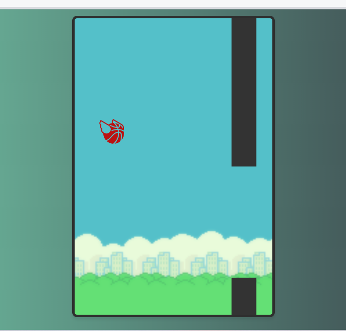

# FlappyBird

Implementacion simple de Flappy Bird.

Diseño de ***Patrick***.

Tutorial en el siguiente enlace [Programación ASMR](https://www.youtube.com/watch?v=gOEiSZVKfBA&list=WL&index=12&ab_channel=Patrick).

De clic al siguiente enlace para ir a la práctica [link](https://hydr0bius.github.io/FlappyBird/).

Interfaz de la app:
